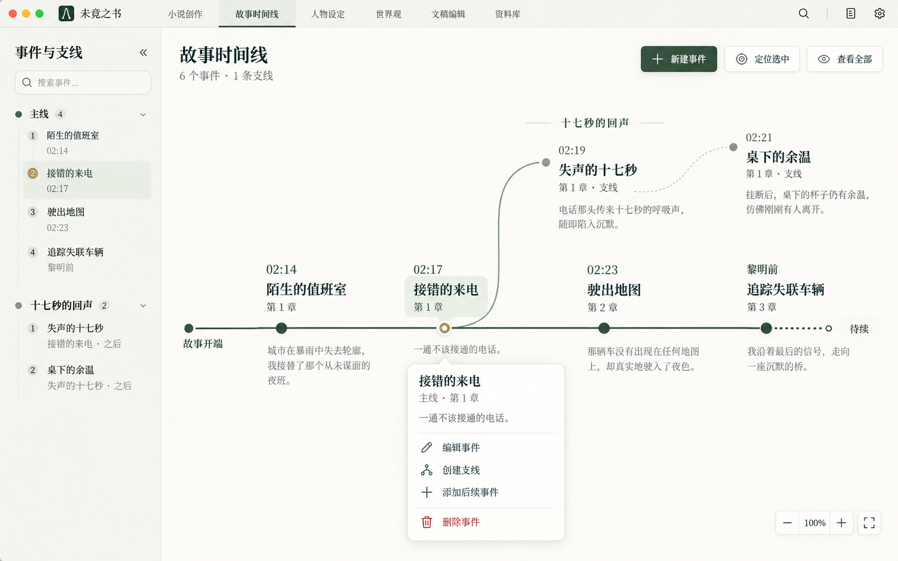

# 故事时间线：视觉重设计与交互改造 · 多模型执行指令

日期：2026-10-03。项目：`D:\ai\AI-Novel-Writer-master`。

本文是执行交接，不是已完成报告。时间线改造尚未实施。当前工作区有其他已授权 UI 修改，必须保留。

## 1. 用户已确认的目标

用户认为目前时间线“不好看、不美观”，已经认可下图的视觉方向，要求给多个模型详细、可并行执行的指令。



图的项目内路径：`docs/handoffs/assets/story-timeline-approved-concept-2026-10-03.png`。

必须落实：

1. 重设计时间线节点、主轴、分叉、字体、留白与层次，不接受仅替换颜色。
2. 左侧“事件与支线”内侧栏可收起，收起后画布填满释放的空间，始终有展开按钮。
3. 单击事件只选中，不再在画布下方展开占空间的事件详情。
4. 右键事件，在鼠标附近、画布边界内打开详情与操作浮窗；不遮罩整个应用，不增加底部面板。
5. 浮窗具有编辑事件、创建支线、添加后续事件、删除等真实入口；双击事件直接进入该浮窗的编辑状态。
6. 支线功能不能被美化删掉；保留分叉来源、嵌套支线、折叠、展开、创建后的可发现性。
7. 主画布以内容为中心，事件保持可读大小，改善当前巨大空白、事件被缩成小块的情况。

### 图片解释与范围边界

- 图片是画布视觉参考，不是应用导航改版指令。不得照图新增 macOS 红黄绿窗口按钮，不得替换 Windows 标题栏、现有标签栏、全局侧栏或全局 AI 面板。
- 图片中的事件名、时间、描述、人物、章节都是展示样例，不得写入用户项目。真实标题、描述、时间、归属与状态只读自现有数据。
- 图片里的“待续”不能覆盖用户设置的结束锚点名称。起止名称和时间继续来自项目设置。
- 复刻重点：浅纸色底、墨绿主轴、灰绿分支、舒展曲线、节点上的文字排版、选中浅底、少量暖金强调、局部右键浮窗。不是把图当背景，也不是用截图代替可交互组件。
- 不把画布换成普通章节列表，不移除 pan/zoom，不引入另一个画布库。继续使用 `@xyflow/react`。
- 不实现自动生成剧情、自动推断时间、自动关联角色、AI 写入时间线等未请求功能。

## 2. 开工前必做

每个执行模型先读本文件、参考图、自己会修改的文件及适用 AGENTS.md；执行 `git status --short` 与目标文件 `git diff`。先报告当前基线和负责的文件，再修改。

当前已核验：`StoryTimelineView.tsx` 有一处此前授权修改，把人物跳转从 `openCharacterProfile('overview')` 改为 `openCharacterProfile()`，目的是默认打开角色编辑页。必须保留。

其他未提交修改涉及蓝图排版、绑定弹窗与卷筛选、角色编辑页、项目总览导航、侧栏默认折叠、测试与截图。禁止 reset、checkout 覆盖、清理掉这些文件，禁止借本任务提交无关回退。不要把“当前工作树不干净”当成需要重新设计或丢弃历史工作的理由。

多模型不得在同一目录并发改同一文件。推荐由总协调者从包含当前必要修改的同一基线创建独立 worktree，分支前缀 `codex/`。新 worktree 不会自动带上未提交修改：必须先建立经核对的共享基线或精确补丁，不能只从旧 HEAD 开工再声称保留了现有行为。不要未经用户授权推送、发布或合并远程 PR。

## 3. 当前代码地图与已核验问题

| 位置 | 当前职责 |
| --- | --- |
| `src/components/timeline/StoryTimelineView.tsx` | 页面编排、内联节点与连线组件、视口、选择、过滤、右键、底部详情、创建与保存回调 |
| `src/components/timeline/story-timeline-layout.ts` | 纯布局；排序刻度映射、主轴、分支、起止锚点、同刻度错位 |
| `src/components/timeline/TimelineEventModal.tsx` | 事件/后续事件/支线首事件的表单，目前全页遮罩弹窗 |
| `src/components/timeline/TimelineContextMenu.tsx` | 事件、空白、起止锚点的右键菜单，目前按整个窗口边界避让 |
| `src/components/timeline/TimelineRangeModal.tsx` | 自定义刻度、故事起止范围 |
| `src/stores/story-timeline-store.ts` | 状态与带项目会话的 IPC；保存失败通常返回 false |
| `src/shared/story-timeline.ts` | 事件、支线、范围、默认值等共享数据契约 |
| `src/shared/ipc-channels.ts` | `db:timeline-*` 类型化 IPC 契约 |
| `electron/controllers/db-controller.ts` | 时间线 IPC 处理、项目校验、写入通道登记 |
| `electron/repositories/story-timeline-repository.ts` | SQLite 读写、删除事件时级联删除其下游分支 |
| `src/components/planning/PlanningPageShell.tsx` | 多个创作规划页面共用外壳；不得为时间线无条件改变所有页面 |
| `src/index.css` | 现有 `.writer-timeline-*` 样式；注意其覆盖顺序 |

已核验事实，实施时再次确认当前代码：

- 右键创建支线、单击列表定位、分支展开折叠已经存在，不能重复实现另一套状态。
- 初始化 `fitView` 包含起止锚点，大范围时容易把事件缩小；列表定位保留当前 zoom，极小 zoom 下仍不可读。
- 当前统计直接用 `branches.length`，数据内含 `main`，会把主线误算为支线。
- `handleModalSave` 遇到 false 会返回，但表单 `await onSave()` 后仍执行 `onClose()`，存在失败后关闭输入的问题。
- 创建支线先保存 branch、再保存首事件，两次写入不是一个事务；可能留下空支线。
- 列表会跳过没有事件的支线，空支线可能不可见。
- 删除分叉事件会级联删除下游支线和事件；当前 UI 入口没有完整影响预览与确认。
- 当前布局位置由数据推导，不应为了视觉排布写回事件 `sortOrder`。

## 4. 并行策略：先冻结接口，再 A/B/C/D 并行

### 任务 0：总协调者，短前置步骤

在四个任务开工前完成：

1. 固定共享基线及本文件、参考图。
2. 创建只含类型的 `src/components/timeline/timeline-ui-contract.ts`，定义以下组件边界并给四个任务确认。此文件只由协调者修改。
3. 接口冻结后 A/B/C/D 同时工作；D 可以先完成侧栏和集成骨架，但最终接入、全量验收必须等待 A/B/C 的真实实现，不能拿 mock 声称完成。
4. 需要变更接口时先通知其他任务，协调者一次更新；禁止各任务自行发明同名不兼容类型。

推荐接口语义（命名可在任务 0 一次性调整，之后冻结）：

```ts
type TimelineUiResult = { success: true } | { success: false; error: string }
type TimelineScreenPoint = { clientX: number; clientY: number }
type TimelineViewportIntent = {
  nonce: number
  kind: 'initial' | 'fit-all' | 'focus-event'
  eventId?: string
}
type TimelineFloatingTarget =
  | { kind: 'event'; eventId: string; point: TimelineScreenPoint; mode: 'details' | 'edit' }
  | { kind: 'create'; mode: 'create-main' | 'create-next' | 'create-branch'; sourceEventId?: string; suggestedOrder?: number; point: TimelineScreenPoint }
  | { kind: 'anchor'; anchor: 'start' | 'end'; point: TimelineScreenPoint }
  | { kind: 'canvas'; suggestedOrder?: number; canCreate: boolean; point: TimelineScreenPoint }
```

公共约定：

- Canvas 回调用浏览器 `clientX/clientY`；浮窗宿主用画布 DOMRect 转局部坐标。必须区分窗口、画布容器、React Flow 三套坐标。
- 新的 Scene 是纯渲染/视口组件，接收 events、branches、expandedBranchIds、settings、selectedId、viewportIntent，以及 select/context/edit/toggle 回调；不直接保存数据库。
- 浮窗接收 target、画布 bounds、真实事件与可选关联候选；提交统一返回 `Promise<TimelineUiResult>`。组件自行显示错误，只有 success 才结束本次编辑。
- D 将 C 保留的 boolean store API 在页面适配为 `TimelineUiResult`，不得让 A/B 直接依赖具体 IPC。
- C 提供独立的原子创建操作，提交完整 branch 与首 event，成功返回同一提交结果中的两者。既有 upsert 单项接口保持兼容。
- 事件 selection、floatTarget、过滤、侧栏展开、viewportIntent 是不同状态，不用 `selectedId !== null` 代替浮窗是否打开。

## 5. 统一视觉规格

以下尺寸以应用实际 100% 缩放时 CSS px 为单位，允许为真实内容微调，但必须截图解释差异。

### 页面与画布

- 保留全局应用外壳，只在时间线页面内重排。标题、统计与工具栏保持紧凑，不用营销大标题。
- 内侧栏建议 220–260px；窄面板可收起。画布 `min-width: 0; min-height: 0`，占据剩余宽高。
- 画布使用主题的纸色/editor surface token，不固定纯白；移除明显点阵。默认主题下采用墨绿、灰绿、暖纸色，深色主题也必须可读。
- 不用玻璃拟态、霓虹、亮蓝色系统选中框、厚阴影、渐变主线。圆角保留，画布四周裁切与外壳衔接干净。

### 节点

- 正常事件是轻量文字块，不是统一白色带阴影矩形卡片。事件与其轴上圆点在视觉上属于同一整体。
- 时间 12–13px，标题 16–18px，中等/略粗字重；元信息 11–12px，描述 12–13px，行高约 1.5。不能只把整个小节点等比放大。
- 标题最多展示两行；描述最多两行，可在浮窗看完整文本。长中文、英文长词都要合理换行；缺失信息不编造、不显示 undefined。
- 基本文字区域建议 180–240px，节点间距按实际文本边界计算。字符估算需要保守，不能用固定单行高度处理所有内容。
- 选中节点浅青底、轻描边或暖金小圆点；避免同时强边框、外发光和重阴影。暖金色用局部语义变量映射到现有主题 token。
- 状态不能只靠颜色传达；显示短文本或可访问标签，保持 planned/drafted/finalized 原语义，不自动与正文发布状态混同。
- 只显示真实存在的关联章节；摘要来自用户描述，不能 AI 生成或修改原文。

### 路径

- 主轴约 2px；分支约 1.5px；轴点直径约 8–12px，选中可略大。
- 主线从左至右；支线从真实 sourceEventId 自然分叉，曲线平滑、不穿过文字。
- 默认连续线，不无条件虚线；图中虚线只是视觉示意，不得擅自引入“未知/待定”的新数据语义。
- 起止锚点用轻量端点＋名称，隐藏开发式 `[0]` 刻度标签；范围设置仍可访问，实际存储不变。
- 支线名放在所属路径附近，不能遮挡其他分支；同刻度事件、同一来源多支线、嵌套支线、折叠后剩余节点均应稳定排布。

### 交互浮窗

- 浮窗位于画布内容层之上、全应用对话框之下；建议详情宽 280–340px，编辑宽 360–440px，并按可用画布宽度缩小。
- 画布四边至少留 12px；优先鼠标右下，放不下则翻转/钳制。高度受画布约束，内容内部滚动，保存按钮可见。
- 详情无全屏遮罩；浮窗内容点击、滚动、输入不能触发画布平移或缩放。
- 选中不自动弹出，右键显示详情，双击编辑；右键空白或锚点显示各自适当操作。
- 清洁状态点空白/Escape 可关闭；有修改时不能静默丢弃，提供局部“继续编辑 / 放弃修改”提示；不允许每次普通选择都弹确认。
- 保存期间防重复提交；失败保留输入与焦点，显示可理解错误；成功默认回该事件详情并保持视角，不跳回全局适应视图。
- 右键之外提供键盘替代：节点 Enter 打开详情，Shift+F10/菜单键打开操作；Escape 关闭并回焦到触发节点。不要只支持鼠标。

## 。6. 任务 A：画布视觉、节点连线、布局与视口

### 可直接发给模型 A

你负责把参考图的视觉语言实现为真实 React Flow 时间线画布。先读第 1–5 节，严格遵守数据边界。你不是重做应用外壳，也不是改业务保存。

独占文件：

- 新建 `src/components/timeline/StoryTimelineScene.tsx`，包含新的节点、边、锚点渲染及 React Flow 宿主。
- 新建 `src/components/timeline/story-timeline-scene.css`，全部作用域限定在 Scene 内。
- `src/components/timeline/story-timeline-layout.ts`。
- `src/components/timeline/__tests__/story-timeline-layout.test.ts`。
- 可新增专属 `StoryTimelineScene.browser.tsx` 测试与 fixture。

不能修改 `StoryTimelineView.tsx`、store、IPC、浮窗、全局 CSS；由 D 接入你的 Scene 并移除旧内联渲染器。现有布局导出签名尽量保留，可向输出增加纯展示字段，不改存储模型。

实现要求：

1. 按视觉规格重做文字节点、起止端点、主轴、分支与支线标题。引用现有本地字体，不下载安装新字体。
2. 保留按刻度布局语义，不能为减少空白把 sortOrder 写成连续整数。若采用非线性显示压缩，必须显式模式/断轴说明；默认先用合理视口解决空白问题。
3. 同刻度允许多个节点；用明确、稳定的避让布局解决重叠。分支折叠不能让无关节点随机跳位。
4. 初次进入有事件时以事件内容范围确定阅读视角，不被远端锚点强制缩成蚂蚁。显示比例建议不低于约 0.75；内容超出则允许平移。
5. “查看全部”可缩小显示整个范围；“定位选中”恢复可读缩放并居中。不要每次 setState、保存、改变选择或改变侧栏宽度都 fitView。
6. 侧栏伸缩时尽量保持原画布中心和 zoom；卸载重入的视口由 D 保存/恢复。ResizeObserver 不得产生无限布局循环。
7. 不启用事件拖拽或任意连线修改数据；当前仅允许画布平移缩放。
8. 移动、缩放开始时通知 D/B 关闭清洁浮窗；脏编辑浮窗不得因 pan 失去数据。

独立验收：空时间线、1 个事件、主线 6 事件＋1 支线、同刻度 8 事件、一个来源 3 支线、3 层嵌套、长标题、100+ 事件均无文字重叠或 NaN 坐标。纯布局不产生数据写入。交付 Scene props 使用示例、截图与测试输出

## 7. 任务 B：画布内浮窗、事件表单、关联选择

### 可直接发给模型 B

你负责局部详情/编辑浮窗，替换占据底部的详情体验及全屏事件编辑遮罩。视觉严格参考第 5 节。不要修改时间线页面主文件或后端。

独占文件：

- 新建 `TimelineFloatingPanel.tsx`、`timeline-floating-panel.css`。
- `TimelineContextMenu.tsx`、`TimelineEventModal.tsx`。
- `TimelineRangeModal.tsx` 仅在必要兼容或字段文案范围内调整，不擅自重做范围数据模型。
- 可新增 `TimelineEventForm.tsx`、`TimelineAssociationPicker.tsx` 及专属浏览器测试。

旧导出在 D 接入前保持可编译；优先抽出共享表单，旧 Modal 临时包装它，新浮窗也用同一表单，避免两套验证与数据构造。

实现要求：

1. 使用画布容器 bounds 而非 window.innerWidth/Height 做避让。尺寸变化/侧栏折叠时重新钳制位置；缩放 DOM transforms 不能让浮窗跟随节点缩成小字。
2. 详情展示真实标题、时间、状态、主/支线、描述、关联信息；内容为空显示简短真实空状态。
3. 清晰提供“编辑事件 / 创建支线 / 添加后续事件 / 删除”。删除放在分隔后的危险区，调用 D 提供的影响预览/确认动作，不直接删除。
4. 编辑保存留在本事件，失败保留输入；实现关闭保护、dirty 跟踪、重复提交防护、键盘访问及回焦。
5. 创建支线表单明确“从事件 X 分叉”，填写支线名称和首事件；名称必填，不能显示必填星号却静默填成“支线”。首事件不要虚构。
6. 事件时间、时间精度/区间、排序位置、描述、状态、章节、人物、地点原字段全部保留。共享类型中的 `isHistorical`、`outcome`、`aftermath` 等兼容字段即使本次不展示，也不能在保存时被空值覆盖或丢失；更新载荷应基于原记录合并明确编辑的字段。界面不要泄露 sortOrder 变量名；“排列位置”给解释，并保留手动可控。
7. 后续位置按同支线的相邻事件建议；不要总用主线最大序号，也不要覆盖相邻事件。超出范围时给清晰修正入口，不能自动扩写作者已确认的范围。
8. 关联章节按真实卷筛选、按章号/标题搜索，多选；人物搜索选择；地点保留结构化 ID。候选从现有有界数据读入，不全量加载蓝图 Markdown。
9. 既有手写角色名、无效旧关联应保留并标注“未找到”，不能因选项不含它就删除。不得凭章节号推测卷归属。
10. `@人物` / `[[人物]]` 识别与跳转继续可用。用中文和英文文案，不硬编码只对中文可读的流程。

独立验收：四边溢出、短画布、长文本、清洁/脏 Escape、点击外部、输入时滚轮、保存失败重试、搜索无结果、缺失旧关联、会话变化关闭等场景。不能只测试静态渲染。

## 8. 任务 C：保存与删除可靠性、原子创建支线

### 可直接发给模型 C

你负责数据层与 store 的正确性，不负责画布样式。保留现有数据库事实源、项目会话边界、事件/支线 ID 与旧数据兼容。

独占文件：

- `src/stores/story-timeline-store.ts`。
- `src/shared/story-timeline.ts`、`src/shared/ipc-channels.ts`。
- `electron/repositories/story-timeline-repository.ts`。
- `electron/controllers/db-controller.ts` 的时间线区段与相关写入通道登记。
- 必要的既有 IPC 安全注册/校验文件，仅限新通道接入。
- 仓库/store/IPC 对应测试文件。

不能改 UI 主文件、布局和 B 的表单。

实现要求：

1. 新增原子“创建支线＋首事件”操作：一个 SQLite 事务内验证来源和归属、写入两者，全部成功才提交。失败整体回滚。重复提交使用稳定 ID，不能生成重复支线。
2. 后端检查 sourceEventId 存在于当前项目、不能形成环、branchId 与首事件归属一致、范围/有效数值符合现有规则。不要只依赖前端检查。
3. 新 IPC 通过现有项目会话、expectedProjectPath、写入保护等完整链路。旧 invoke 通道不删除，不破坏既有调用方。
4. store 仅在确认成功且会话仍有效时更新 branches/events/expandedBranchIds，避免先显示成功后落库失败。失败返回明确结果并保持 UI 能重试。
5. 提供删除影响预览：目标、被删事件 ID、被删支线 ID、计数。共享同一个递归收集逻辑供预览与真实删除使用，不让 UI 自己猜级联。
6. 确认到实际删除期间如果影响集合变化，返回需要重新确认，不静默扩大删除范围。可以用规范化 ID 集合指纹，不强制为此升级数据库结构。
7. 删除主时间轴或范围锚点必须拒绝。保留既有级联语义，不新增“自动迁移支线到主线”。
8. 支线重命名、删除使用真实 store/IPC。空支线保持有效、可读取。不要为了修复历史空支线静默清理用户数据。
9. 若旧布尔 API继续使用，保持签名兼容，并给 D 明确错误适配方法。不得让保存失败在 UI 层被当作成功 Promise。

验证：事务第二步故障注入、来源不存在、跨项目/旧 lease、重复 ID、嵌套级联、预览后新增下游事件、主线删除拒绝、重启读回。使用临时测试数据库，严禁读写用户小说项目或 `D:\Desktop\小说` 母稿。

原生 ABI：浏览器测试不需要改 native 二进制。仓库测试如需 Node ABI，先核查是否有用户 Electron 实例使用同目录；不得终止别人的进程或盲目重建正在使用的依赖。用项目已有隔离测试方式，并报告实际运行环境。

## 9. 任务 D：页面编排、折叠侧栏、集成与验收

### 可直接发给模型 D

你是页面集成者，拥有主文件最终编排权，但不能抢改 A/B/C 所属文件。在接口冻结后先完成侧栏与状态编排；A/B/C 交付后接入真实组件与 API，再完成完整验收。

独占文件：

- `src/components/timeline/StoryTimelineView.tsx`。
- 新建 `TimelineEventSidebar.tsx`、`story-timeline-workbench.css`。
- `src/components/timeline/__tests__/StoryTimelineView.browser.tsx`。
- 时间线专项验收报告、真实 UI 截图；不要覆盖其他任务的 fixture。

共享外壳与全局 CSS默认只读。若清理旧 `.writer-timeline-*` 必须先检索所有引用，确认 A/B 新样式覆盖与引用迁移完毕，再由 D 单独提交；不能泛改按钮、所有菜单、所有 PlanningPane。

实现要求：

1. 将旧内联节点/边渲染迁往 A 的 Scene，接收 A 的交互意图；不要留新旧两套 React Flow 或两套选中状态。
2. 删除底部常驻事件详情的渲染路径，接入 B 的单一画布内浮窗。不能只是 CSS display:none，仍保留重复可聚焦控件。
3. 内侧栏默认展开，有明确收起/展开按钮。折叠只隐藏内侧栏，不影响全局项目导航。收起后无占位空白；筛选、选中、分支展开和缩放不丢。
4. 侧栏仍按主线/支线分组，所有空支线也显示；主线不显示删除/重命名为支线的危险操作。支线标题提供重命名、添加事件、折叠、删除入口。
5. 统计支线数排除 main。过滤结果数与总数明确区分；筛选只作用列表还是也作用画布要有清晰说明，默认保留现有“筛选列表”的语义。
6. 点击列表定位时展开目标的所有祖先支线，而非仅自身分支；调用 A 的可读比例 focus intent。
7. 创建分支成功后展开祖先及新支线，选中并定位首事件；创建空支线的独立流程不在本轮新增。
8. 保存适配显式读取 success；失败不能关闭浮窗；成功应用返回数据，不靠整页重载刷新。任意状态更新不重新 fitView。
9. 删除任何入口均经过 C 的影响预览和确认；提示“将删除 X 个事件、Y 条支线”，失败保留上下文，成功清理失效 selection/floatTarget。
10. 侧栏折叠与视口建议保存为项目隔离的 UI 偏好，不写业务表。持久化需校验数字、zoom 边界；切项目不能复用另一项目的选中或浮窗。
11. 主工具栏包含新建事件、定位选中、查看全部、刻度设置；无选中时定位按钮禁用。保留已有面包屑及真实页面入口。
12. 做好 loading、读取失败可重试、空时间线首事件创建；不得把读取失败伪装成空项目。

最终禁止：通过更改用户的故事时间/标题/排序来“摆出与样式图一致”的结果；为截图造一个不走 store 的假页面；只展示静态 mock 就宣布集成完成。

## 10. 最终验收矩阵与交付证据

### 视觉与布局

- 1440×900、1920×1080；另测带全局侧栏和 AI 面板、内部剩余宽度约 900px 的情况。
- 窄内部画布约 600×500，编辑浮窗不得超出画布；100%、125%、150% 应用缩放下不遮挡按钮。
- 默认青绿色、另一浅色主题、至少一种深色主题；中文和英文、长章节/卷名。
- 空数据、1 事件、参考图密度、同刻度密集、多支线/嵌套、长文本、100/500 事件。
- 截图至少：整体、选中、右键详情、编辑、侧栏折叠、窄画布、密集分支、深色主题。
- 按图核查：无重复白色卡片墙、无亮蓝色外框、无底部详情占位、节点文字能读、主支线路径清楚、圆角和主题一致。

### 实际交互与数据

1. 单击→只选中；右键→画布内浮窗；双击→同一浮窗编辑。
2. 鼠标靠画布四角右键，浮窗仍在画布内；浮窗内滚动不缩放画布。
3. 收起/展开侧栏，筛选与 zoom 保留，无自动跳回原点。
4. 列表定位隐藏的嵌套支线事件，所有祖先展开、事件可读。
5. 修改→保存→留在该事件→退出重进/重新读取，数据一致。
6. 修改后点外部/Escape，不静默丢失；保存失败保留字段与焦点，重试可成功。
7. 创建支线的第二步故障，数据库中没有半成品；成功后首事件立即可见。
8. 删除来源事件明确预览下游影响；取消零写入；确认才删除；预览后结构变化要求重新确认。
9. 绑定章号/人物/地点的旧值保持；新选择能保存；切换项目时迟到响应不能污染新项目。
10. 键盘完成选择、打开浮窗、编辑、保存、关闭，焦点不丢到页面底部。

### 推荐命令

本机先前 `pnpm exec vitest` 存在命令解析问题，可直接调用已安装脚本：

```powershell
node node_modules/typescript/bin/tsc --noEmit
node node_modules/vitest/vitest.mjs run --config vitest.browser.config.ts src/components/timeline/__tests__/StoryTimelineView.browser.tsx
node node_modules/vitest/vitest.mjs run src/components/timeline/__tests__/story-timeline-layout.test.ts
git diff --check
```

补跑 A/B/C 新增测试、仓库测试及受影响 IPC 检查。端口冲突不要终止其他实例，使用项目已有浏览器测试端口环境变量分配独立端口。执行前读当前配置；不要把旧测试数量、旧报告或上次 typecheck 当成新改动的通过证据。

旧测试“所有事件上下交替”“单击展示底部详情”“遮罩关闭编辑”等断言需要随已确认设计更新；数据语义、分支来源和真实保存断言必须保留，禁止整块删除测试换取绿灯。遇到 ResizeObserver、console.error 等要分类解释，不能只写 exit code 0。

### 每个任务的交付格式

1. 改了哪些文件，以及为什么。
2. 保留了哪些既有行为、有哪些对接接口。
3. 实际执行的命令及结果；未运行/被阻塞的检查如实说明。
4. 截图或数据读回证据的路径。
5. 需要其他任务接入的具体 export/props/IPC；剩余问题不能藏在“完成”里。

总协调者按 A/B/C→D 的顺序集成，检查合并后的同一版本，再给最终完成报告。完成判据是用户入口→画布交互→浮窗编辑→真实 IPC→数据库回读完整连通，并达到视觉参考方向；不是四个模型分别说“写完了”。
